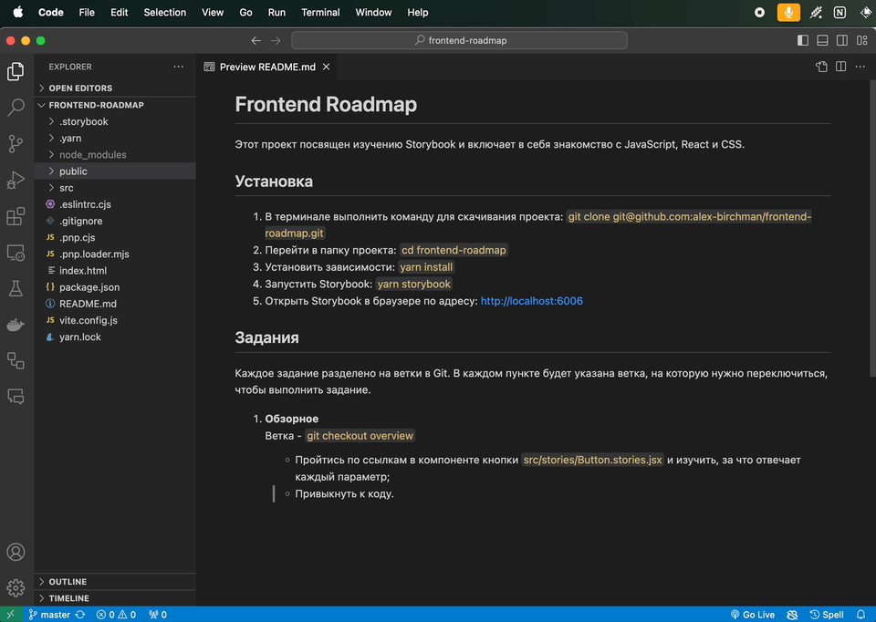

# Frontend Roadmap

Этот проект посвящен изучению Storybook и включает в себя знакомство с JavaScript, React и CSS.

## Установка
  
1. В терминале выполнить команду для скачивания проекта: `git clone git@github.com:alex-birchman/frontend-roadmap.git`
2. Перейти в папку проекта: `cd frontend-roadmap`
3. Установить зависимости: `yarn install`
4. Запустить Storybook: `yarn storybook`
5. Открыть Storybook в браузере по адресу: http://localhost:6006  

## Задания

Каждое задание разделено на ветки в Git. В каждом пункте будет указана ветка, на которую нужно переключиться, чтобы выполнить задание.

1. **Обзорное**  
   Ветка - `git checkout overview`

   - Пройтись по ссылкам в компоненте кнопки `src/stories/Button.stories.jsx` и изучить, за что отвечает каждый параметр;
   - Привыкнуть к коду.

---
## Инструкции
Как переключить ветку в git?

